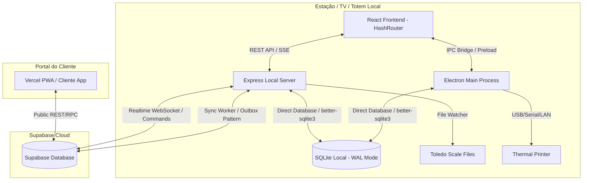

# ChamaAí - Documentação de Arquitetura

## Arquitetura Completa

O ChamaAí é construído sobre uma arquitetura híbrida distribuída local-nuvem, operando de forma offline-first e sincronizada em segundo plano.

## Fluxo dos dados

### 1. Emissão de Senha no Totem
1. O cliente toca no Totem de autoatendimento (`/totem`).
2. O React dispara uma requisição `POST /api/senhas/emitir`.
3. O servidor Express cria o registro no banco de dados SQLite local.
4. O servidor também enfileira a operação de inserção na tabela local `supabase_sync_queue` (Outbox Pattern).
5. O Express responde à chamada React, que aciona o processo Electron para imprimir o ticket físico na impressora térmica via `node-thermal-printer`.
6. O Supabase Sync Worker envia o registro do SQLite para a nuvem de forma assíncrona em até 5 segundos.

### 2. Chamada de Senha pelo Guichê
1. O operador clica em "Chamar Próxima" no terminal (`/operador`).
2. O React chama `POST /api/chamar-proxima` no Express local.
3. O servidor altera o status da senha para `chamada` no SQLite local e registra a chamada na tabela `chamadas`.
4. É enfileirado um comando de update para a tabela `senhas_publicas` do Supabase via `supabase_sync_queue`.
5. O Express envia um evento SSE (`NOVA_SENHA_CHAMADA`) para todos os clientes conectados.
6. A TV/Telão (`/telao`) recebe o evento SSE e reproduz o alerta de som campainha (normalizado pela Web Audio API) e atualiza o estado visual acelerado por GPU (300ms de atraso intencional no áudio para evitar stuttering na animação).

### 3. Toledo Watcher (Sincronização de Preços da Balança)
1. O software Toledo MGV7 gera e grava o arquivo `ITENSMGV.TXT` (ou similar conforme configuração) no diretório de rede local.
2. O `toledo-watcher.ts` no Express monitora modificações de arquivo de forma dinâmica a cada 5 segundos.
3. Ao detectar alteração, aguarda 3 segundos de debounce para estabilização de gravação.
4. Lê o arquivo com codificação Windows-1252 (latin1), processa os registros baseados no leiaute definido no `file-parsers.ts`, valida os dados e executa uma transação no SQLite atualizando e inserindo registros na tabela `toledo_produtos` (removendo itens órfãos com trava de segurança de 10% para evitar deleções em massa por arquivos incompletos).
5. Em caso de mudanças de preços de produtos, dispara um evento SSE `TOLEDO_PRECOS_ATUALIZADOS` para atualizar os encartes das TVs locais e inicia a fila de sincronização em lote de 500 produtos para a tabela `toledo_produtos_publicos` do Supabase.

## Componentes Técnicos

### Frontend (React + Tailwind)
- **Localização**: `src/`
- **Controle de Estado**: Estados locais React estruturados por tela para manter alto desempenho.
- **Design**: Visual premium baseado em Glassmorphic design, utilizando HSL customizado para o tema do estabelecimento.
- **Roteamento**: `HashRouter` para evitar quebra de rotas no carregamento de arquivos locais no Electron (`file://`).

### Backend (Express 5)
- **Localização**: `server/`
- **Server-Sent Events (SSE)**: Canal `/api/events` envia notificações rápidas em formato texto plano estruturado sem o overhead do WebSocket local.
- **Supabase Cloud Sync Worker**: Loop autônomo baseado em intervalo (`setInterval`) que consome a fila local `supabase_sync_queue`. Ele monitora erros de conexão de internet para pausar o envio de dados até que a rede retorne, evitando descartes incorretos ou estouros de tentativas.

### Banco de dados (SQLite)
- **Localização**: `C:\ChamaAi\database.sqlite` (Gerenciado por `better-sqlite3`).
- **Pragmas**: Inicializado em modo WAL (`journal_mode = WAL`) para suportar concorrência de leitura e escrita sem bloqueio entre os threads do Electron principal e do Servidor Express.
- **Schema e Seed**: Migrações automáticas inline executadas a cada startup no arquivo `electron/services/database.ts`.

### APIs
- `/api/auth`: Login, validação de tokens e perfil do operador.
- `/api/configuracoes`: Leitura e escrita de parâmetros dinâmicos do sistema.
- `/api/senhas`: Emissão, chamado, estorno, devolução, controle de status das senhas.
- `/api/midias`: Controle de imagens/vídeos promocionais da TV de chamadas.
- `/api/teloes`: Gerenciamento de códigos e layouts de TVs vinculadas.
- `/api/toledo`: Configuração, monitoramento de logs e recarga de categorias da balança.

### Integrações
- **Supabase Cloud**: Replicação das senhas públicas e produtos de preços para consulta externa e recebimento de comandos do operador remoto via WebSocket Realtime.
- **Toledo MGV7**: Leitura física de arquivos TXT/CSV/XLSX gerados pelo MGV (e outras marcas como Filizola, Gertec) para integração do encarte de ofertas na TV de chamadas.
- **node-thermal-printer**: Driver direto ESC-POS para suporte a impressoras EPSON/Elgin térmicas conectadas.
