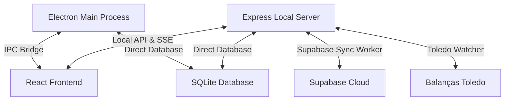

# 🚀 ChamaAí - Sistema de Gestão de Filas e Totem de Senhas

ChamaAí é um ecossistema completo de alta performance para controle de filas, painel de chamada de senhas, totens de atendimento e painéis de encartes/mídia. Desenvolvido com foco em estabilidade e otimização para hardwares limitados (como computadores de Totem e TVs embarcadas), o sistema utiliza uma arquitetura híbrida robusta combinando Electron, React, Express e banco de dados SQLite local com sincronização Supabase na nuvem.

---

## 🏗️ Arquitetura do Sistema

O sistema é dividido em três camadas principais:



### 1. Processo Principal (Electron - `electron/`)
* **Gerenciamento de Janelas**: Kiosk mode blindado com bloqueio estrito de atalhos do Windows (`Alt+F4`, `Ctrl+W`, `Ctrl+Q`), perfeito para totens de atendimento de livre acesso.
* **Impressora Térmica**: Serviço nativo integrado (`node-thermal-printer`) para comunicação direta via USB, serial ou rede (Epson/ESC-POS) com impressão automática de tickets de senhas e relatórios.
* **Atualizador Inteligente**: Motor de auto-atualização offline que consome pacotes em rede local e executa a instalação silenciosa sem travar processos.

### 2. Servidor Local (Express - `server/`)
* **API REST local**: Responsável pelas chamadas administrativas, gerenciamento de operadores e emissão de senhas.
* **SSE (Server-Sent Events)**: Canal de comunicação em tempo real de altíssima velocidade para alteração instantânea de senhas e comandos entre guichês, telões e operadores.
* **Toledo Watcher**: Monitor inteligente de arquivos de balanças Toledo em tempo real para sincronização rápida de preços e encartes.
* **Supabase Sync Worker**: Mecanismo de backup redundante que espelha dados locais para o Supabase de forma assíncrona, garantindo que o sistema continue funcionando offline mesmo se a internet cair.

### 3. Front-end (React + Tailwind - `src/`)
* **Design System Premium**: Interface de altíssimo nível baseada em *Glassmorphic design*, cores tailoreadas em HSL, tipografia Google Fonts, transições suaves e micro-animações.
* **Telas Dedicadas**: Roteamento especializado para os diversos terminais:
  * `--totem`: Emissor de senhas interativo com suporte a voz e impressão física.
  * `--telao`: Painel de visualização de chamadas com som sonoro customizado e mídia programática.
  * `--operador` / `--operador-touch`: Terminal para guichês chamarem a próxima senha, gerenciarem fila e reimprimirem tickets.
  * `--admin`: Dashboard de estatísticas, configurações de impressora, operadores e monitoramento.

---

## 🛠️ Tecnologias Utilizadas

* **Core**: React 19, TypeScript, Vite 8, Electron 30.
* **Servidor**: Express 5, Node-Cron (Manutenções agendadas de banco).
* **Banco de Dados**: SQLite local (`better-sqlite3` empacotado nativamente).
* **Nuvem**: Supabase Client (Sincronização assíncrona bidirecional).
* **Estilização**: TailwindCSS e Vanilla CSS com HSL.

---

## 📂 Estrutura de Diretórios

```text
├── .agents/               # Configuração dos Agentes de IA e skills
├── android/               # Código nativo para empacotamento móvel (Capacitor)
├── build/                 # Recursos de build (NSIS, ícones, installer.nsh)
├── dist/                  # Distribuição final compilada do Frontend
├── dist-electron/         # Distribuição final compilada do Electron
├── electron/              # Código fonte do Processo Principal (Electron)
│   ├── services/          # Serviços nativos (Impressora, Banco de Dados SQLite)
│   ├── main.ts            # Ponto de entrada do Electron
│   └── preload.ts         # Ponte de segurança IPC exposta ao front-end
├── server/                # Código fonte do Servidor Local (Express)
│   ├── index.ts           # Endpoints, SSE e rotas locais
│   ├── supabase-sync.ts   # Worker assíncrono de sincronização em nuvem
│   └── toledo-watcher.ts  # Watcher de arquivos Toledo
├── src/                   # Código fonte do Frontend (React)
│   ├── admin/             # Módulo administrativo
│   ├── shared/            # Componentes reutilizáveis (Notificações, layouts)
│   ├── telao/             # Módulo de exibição da TV de Chamadas
│   ├── totem/             # Módulo interativo do Emissor de Senhas
│   ├── App.tsx            # Roteamento geral do front-end
│   └── main.tsx           # Inicialização do React
├── package.json           # Dependências e scripts de automação
└── vite.config.ts         # Configuração de bundler do Vite
```

---

## 🚀 Scripts Disponíveis

No diretório raiz do projeto, você pode rodar os seguintes comandos:

| Comando | Descrição |
| :--- | :--- |
| `npm run dev` | Inicia o servidor Vite e o Electron em modo de desenvolvimento local. |
| `npm run build` | Compila o front-end React e os arquivos do Electron. |
| `npm run rebuild:native` | Reconstrói os binários nativos (`better-sqlite3`) para a arquitetura do Electron. |
| `npm run build:dist` | Reconstrói módulos nativos, compila o projeto e empacota o instalador de produção (`.exe`). |
| `npm run publish:update` | Compila e publica os arquivos de atualização diretamente no GitHub Releases. |
| `att.bat` | Script local que limpa o cache, gera a build de produção e a distribui na pasta offline local. |

---

## 🔄 Sistema de Atualização Automática Offline

O ChamaAí possui um sistema inovador de atualizações sem dependência de internet externa, ideal para redes locais corporativas.

```text
[Aplicativo Instalado (v1.0.103)] 
      │
      ├── 1. Faz busca local HTTP em: http://localhost:3000/local-updates
      ├── 2. Detecta versão mais nova (v1.0.104) disponível em C:\ChamaAi_Atualizacoes
      ├── 3. Faz o download silencioso do instalador
      ├── 4. Exibe card visual: "Instalar Agora"
      │
      └── Ao clicar:
            ├── A. Fecha a aplicação em 50ms (liberando locks de arquivos)
            ├── B. Roda o script de lote desacoplado executar_atualizacao.bat via explorer.exe
            ├── C. O lote executa o instalador em background e aguarda a conclusão (start /wait)
            ├── D. O lote inicia o novo ChamaAi.exe atualizado automaticamente
            └── E. O front-end detecta o upgrade via SQLite e exibe card esmeralda de boas-vindas
```

### Otimizações do Instalador Windows (`installer.nsh`)
1. **Bypass de travamento de registro**: O instalador utiliza a macro `preInit` para remover chaves obsoletas do desinstalador antigo. Isso evita erros de desinstalação silenciosa e permite uma sobreposição 100% limpa.
2. **Auto-inicialização Inteligente**: O script garante que, independente do modo de inicialização (desenvolvimento ou produção), o aplicativo reabrirá instantaneamente após a instalação ser concluída.

---

## 💻 Requisitos e Otimizações de Hardware (Totens)

O sistema possui switches de performance agressivos projetados especificamente para rodar com fluidez em processadores Celeron e 2GB/4GB de RAM (muito comuns em totens de atendimento):
* **Flags ativadas via CLI (Kiosk Mode)**:
  * `disable-site-isolation-trials`: Reduz drasticamente o consumo de RAM em multi-telas.
  * `disable-smooth-scrolling`: Melhora a velocidade de resposta das telas de toque infravermelho/capacitivas.
  * `--max-old-space-size=512`: Limita o Garbage Collector do V8 do Javascript a 512MB para evitar vazamentos de memória.
  * `disable-features=CalculateNativeWinOcclusion`: Evita processamento em segundo plano desnecessário do Windows.

---

## 🔒 Licença

Copyright © 2026 **ChamaAí**. Todos os direitos reservados.
