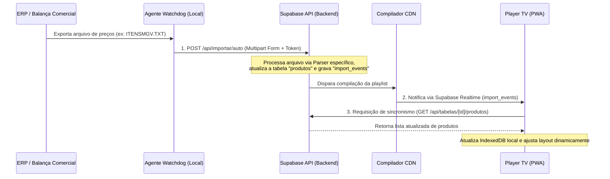

# Documento de Requisitos de Produto (PRD) — Módulo de Encarte Digital

Este documento define os requisitos de produto, especificações técnicas e comportamentos desejados para a funcionalidade de **Encarte** dentro da plataforma **SignageFlow**.

---

## 1. Visão Geral do Módulo

O **Encarte** é o componente visual central do SignageFlow, responsável por exibir produtos, ofertas e menus nas TVs e displays comerciais das lojas físicas. No ecossistema, o termo "Encarte" abrange duas frentes distintas de implementação no player:

1. **Encarte Estático (Imagem/Mídia)**: Exibição em tela cheia de um arquivo de imagem estática enviado por upload ou link de URL externa.
2. **Encarte Digital Dinâmico (Tabelas de Produtos - Layout "Grade")**: Uma aplicação interativa e alimentada por dados em tempo real, que renderiza dinamicamente as ofertas sincronizadas dos ERPs e balanças comerciais locais (Toledo, Filizola, etc.).

Este PRD detalha ambas as frentes, com foco aprofundado na inteligência do **Encarte Digital Dinâmico**, que utiliza algoritmos de layout adaptativo e sincronismo realtime.

---

## 2. Objetivos de Negócio e de UX

* **Prevenção de Quebras Visuais**: Garantir que as informações de preço e descrição do produto ocupem o máximo espaço possível na tela, mas **nunca** gerem estouro de texto (overflow) ou barras de rolagem.
* **Operação em Tempo Real**: Refletir mudanças de preços feitas no sistema de retaguarda (balanças/ERP) nas telas físicas em menos de 10 segundos.
* **Resiliência Total**: Manter a exibição dos encartes e das tabelas ativa mesmo em cenários de queda completa de conexão com a internet.
* **Estética Premium**: Proporcionar uma experiência visual moderna (animações suaves, fontes refinadas, design limpo, transições a 60 FPS) que valorize o ponto de venda.

---

## 3. Arquitetura e Fluxo de Dados

A sincronização e exibição do encarte digital segue o fluxo abaixo:

---

## 4. Requisitos Funcionais

### 4.1. Configuração no Painel Administrativo

O administrador da loja ou operador do portal web deve ser capaz de criar e gerenciar encartes de duas maneiras:

#### A. Cadastro de Encarte Estático (Playlist Editor)
* **Entrada por URL**: Campo para colar o link direto de uma imagem (JPG, PNG, WebP) hospedada externamente.
* **Upload de Mídia**: Selecionar uma imagem da biblioteca do Supabase Storage.
* **Configuração de Tempo**: Definir o tempo de exibição do slide na playlist (em segundos).

#### B. Cadastro de Encarte Digital Dinâmico (Tabelas de Produtos)
No editor de Tabelas de Produtos, ao selecionar o layout **"Grade"** (que ativa o Encarte Digital), as seguintes opções devem estar disponíveis:
* **Nome/Título**: Cabeçalho textual do encarte (ex: "🔥 Ofertas do Dia").
* **Colunas Recomendadas**: Input numérico para sugerir a quantidade de colunas, embora o motor de exibição possa recalcular a melhor proporção.
* **Exibição de Atributos**: Checkboxes para habilitar/desabilitar exibição de Imagem do produto, Preço e Unidade de medida (ex: /KG, /UN).
* **Filtro por Categoria**: Seleção de categorias específicas a serem exibidas no slide (ex: apenas produtos da categoria "Açougue").
* **Opções de Ocultação**: Checkbox para "Ocultar produtos duplicados ou com preço zero" (`ocultar_duplicados_zero`).
* **Design System Customizado**:
  * Cor de fundo (`cor_fundo`).
  * Cor de texto primário (`cor_texto`).
  * Cor de destaque/preço (`cor_destaque`).
  * Tamanho base da fonte.

---

### 4.2. Motor de Renderização do Player (PWA)

A renderização dinâmica do Encarte Digital no player implementa algoritmos inteligentes para garantir conformidade estética máxima.

#### A. Cálculo Inteligente do Grid (`calcGrid`)
A disposição dos cards na tela é calculada com base na quantidade de produtos ativos e na orientação física da TV (Horizontal/Landscape ou Vertical/Portrait):

* **Detecção de Aspect Ratio**: O player detecta o tamanho da tela ativa.
* **Otimização de Espaço**: Escolhe a quantidade de linhas e colunas de forma a minimizar espaços vazios (waste) e manter o aspect ratio dos cards legível (proporções de cards entre `0.5` e `3.0`).
* **Comportamento Responsivo**: Se o número de itens mudar dinamicamente pós-importação, o grid se reorganiza automaticamente no próximo ciclo de exibição.

#### B. Algoritmo de Auto-Fit de Preços e Nomes
Para evitar overflow de texto e garantir máxima visibilidade a distância:
* **Preço Dominante**: O preço é o elemento principal do card (ocupa ~65% da altura). Um algoritmo de busca binária no DOM (`fitTextToContainer`) calcula o maior tamanho de fonte possível (entre `8px` e `600px`) que caiba exatamente na largura e altura disponíveis da área reservada.
* **Tamanho do Sufixo de Unidade**: O sufixo de unidade de medida (ex: `/ KG`) acompanha o preço horizontalmente e é escalonado automaticamente para `35%` do tamanho calculado do preço, mantendo a proporção correta.
* **Nome do Produto**: A descrição do produto ocupa ~25% da altura do card. O algoritmo `fitNameToContainer` calcula o tamanho ideal da fonte limitando a exibição a no máximo 2 linhas com quebra de palavra inteligente (`word-break: break-word`) e elipse no final se ultrapassar o limite.

#### C. Tratamento de Promoções e Badges
Quando um produto possui `preco_promocional` ativo (diferente de nulo):
1. O preço promocional assume o papel de destaque principal com a cor configurada em `cor_destaque`.
2. O preço original é mantido no topo direito do card com tamanho menor e efeito riscado (`line-through`).
3. Uma tag textual (`badge`) com o termo **"Oferta"** é exibida no topo esquerdo do card com fundo destacado.

#### D. Sincronização em Tempo Real (Realtime Channels)
* O player escuta ativamente o canal de eventos de alteração de banco de dados do Supabase.
* Ao receber um novo registro na tabela `import_events` associado à fonte de dados utilizada pelo encarte, o player executa uma chamada em segundo plano para obter a nova tabela de preços e renderiza imediatamente os novos valores na tela com uma animação fluida.

---

### 4.3. Animações e Transições
* **Fade-in Suave**: Cada card possui animação de surgimento gradual (`@keyframes encarte-fadein`) com leve efeito de escala (`scale(0.97)` para `scale(1)`).
* **Efeito Cascata (Staggered Delay)**: Os primeiros 12 cards carregados na tela entram em tempos ligeiramente diferentes (escalonamento de `20ms` por card), dando um aspecto dinâmico e polido à transição.

---

## 5. Requisitos Não-Funcionais

### 5.1. Desempenho e Recursos
* **Suporte de Hardware**: O código CSS e JS deve rodar de forma leve, visando o bom desempenho em hardwares mais modestos (Smart TVs antigas, Sticks HDMI Android, Raspberry Pi Zero).
* **Ausência de Valores Fixos**: Toda a estilização do encarte digital deve ser declarada em unidades responsivas e adaptáveis (`clamp`, `vw`, `vh`, `vmin`, `cqh`, `cqw`), eliminando pixels estáticos (`px` fixo) para garantir que a proporção visual seja mantida em telas HD, Full HD, 4K e TVs dispostas na vertical (retrato).
* **Scrollbar Oculto**: Todo comportamento de rolagem deve ser desativado visualmente (`scrollbar-width: none`) para evitar barras cinzas do navegador na TV comercial.

### 5.2. Disponibilidade Offline-First
* **Manifesto de Sincronismo**: Toda tabela dinâmica carregada pelo player deve salvar seus metadados estruturais no `IndexedDB` local.
* **Cache de Mídias**: As imagens dos produtos carregados dinamicamente via CDN são interceptadas e salvas na `Cache API` do Service Worker.
* **Resiliência**: Caso a TV sofra desconexão, o loop de exibição continuará rodando localmente com base nos últimos preços válidos e imagens cacheadas.

---

## 6. Modelagem de Dados Relacionada

Abaixo está o modelo das tabelas do Supabase que fornecem dados para o Encarte Digital:

### Tabela: `tabelas_produtos`
Representa a configuração visual e de dados do Encarte Digital.
* `id` (UUID): Identificador único.
* `tenant_id` (UUID): Vínculo com a conta do lojista.
* `nome` (Text): Cabeçalho do encarte.
* `layout` (Enum): `"grade"`, `"lista"`, `"destaque"`, `"oferta"`.
* `colunas` (Int): Número de colunas sugerido.
* `mostrar_imagem` (Boolean): Exibe foto do produto.
* `mostrar_preco` (Boolean): Exibe o preço.
* `mostrar_unidade` (Boolean): Exibe unidade de medida.
* `cor_fundo` (Text Hex): Cor do fundo geral.
* `cor_texto` (Text Hex): Cor da descrição.
* `cor_destaque` (Text Hex): Cor do preço.
* `fonte_tamanho` (Int): Tamanho base em pt/px.
* `fonte_dados_id` (UUID): Vínculo com a tabela de produtos sincronizados.
* `ocultar_duplicados_zero` (Boolean): Remove preços zerados e duplicidades.

### Tabela: `produtos`
Contém a lista de preços sincronizada.
* `id` (UUID): Identificador único.
* `codigo` (Text): Código do produto (PLU).
* `descricao` (Text): Nome do produto (ex: "Alcatra Bovina Premium").
* `preco` (Numeric): Preço de venda normal.
* `preco_promocional` (Numeric, nullable): Preço de oferta.
* `unidade` (Text, nullable): Ex: "KG", "UN".
* `imagem_url` (Text, nullable): Link para a foto do produto.
* `ativo` (Boolean): Status de exibição do produto.
* `atualizado_em` (Timestamp): Última sincronização efetuada.
